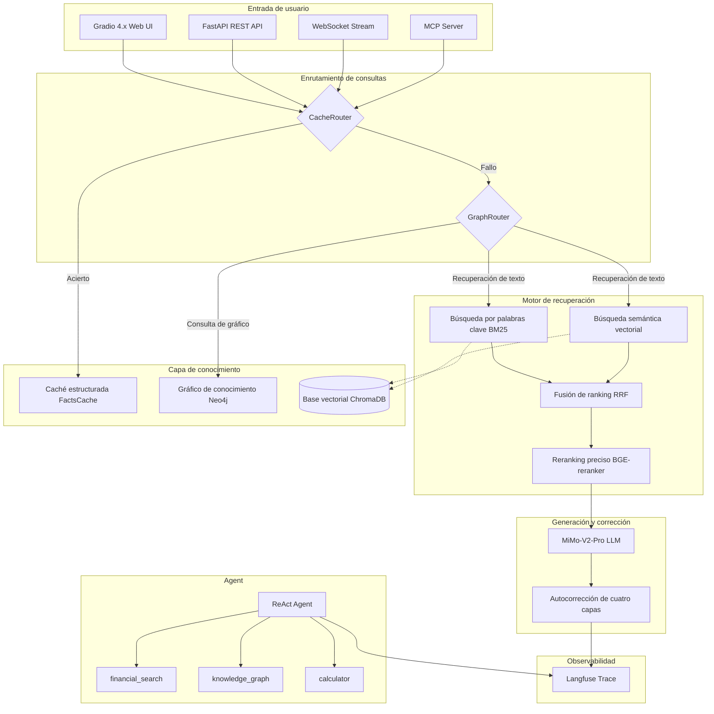

# Financial RAG — Sistema de preguntas y respuestas con base de conocimiento RAG para el sector financiero

> Sistema de Generación Aumentada por Recuperación (RAG) para el sector financiero basado en MiMo + ChromaDB + Neo4j

Sistema de preguntas y respuestas con base de conocimiento de documentos financieros. Genera respuestas financieras profesionales y precisas mediante recuperación híbrida + grafos de conocimiento + autocorrección, integrando modelos de lenguaje grande (LLM). Admite razonamiento multis paso con Agent, integración con el protocolo MCP y observabilidad de extremo a extremo.

## Performance Highlights

| Métrica | Valor | Descripción |
|------|------|------|
| Faithfulness | **0.82** | +1.8% respecto al baseline tras activar Self-Correction |
| Context Precision | **0.73** | Fusión RRF de recuperación híbrida |
| Mejora del Reranker | **+15.3%** | Faithfulness de 0.66 → 0.76 |
| Latencia de recuperación pura | **< 500ms** | Incluye Embedding + ChromaDB + BM25 |
| Latencia de acierto en caché | **< 100ms** | Al alcanzar la caché estructurada FactCache |
| Cobertura de pruebas | **446 tests** | Cero errores con ruff + mypy |

## 系统架构



**Modo Agent** ejecuta un ciclo ReAct independiente: `Thought → Action (financial_search / knowledge_graph / calculator) → Observation`, con un máximo de 6 pasos de razonamiento.

## 核心特性

- **Recuperación híbrida** — Palabras clave BM25 + semántica vectorial + fusión RRF, equilibrando coincidencia exacta y coincidencia semántica
- **GraphRAG** — Tripletes entidad-relación + doble backend Neo4j/NetworkX + enrutamiento gráfico automático
- **ReAct Agent** — Ciclo ReAct codificado a mano (60 líneas centrales), 3 herramientas (búsqueda/gráfico/calculadora), máximo 6 pasos de razonamiento
- **Autocorrección de cuatro capas** — Control de puerta de recuperación → Prevalidación por reglas → NLI de Claims → Verificación externa
- **Mejora de caché (CAG)** — Caché de conocimiento estructurado FactCache, omite la recuperación en caso de acierto
- **MCP Server** — Capacidades RAG encapsuladas como herramientas MCP, invocables directamente por Claude Desktop / Cursor
- **Trazabilidad de extremo a extremo** — Langfuse Trace/Span, diagnóstico retroactivo para cada consulta
- **Múltiples puntos de entrada** — Gradio 4.x (recomendado) + Streamlit (compatible) + FastAPI REST + flujo WebSocket
- **446 pruebas** — Cero errores con ruff + mypy, todas superadas en pytest

## 技术选型

| Componente | Solución | Descripción |
|------|------|------|
| LLM | **MiMo-V2-Pro** | Modelo grande desarrollado por Xiaomi, interfaz compatible con OpenAI |
| Embedding | **bge-large-zh-v1.5** | Vectores semánticos en chino (alojado en SiliconFlow) |
| Rerank | **BGE-reranker-v2-m3** | Reranking preciso Cross-Encoder, ejecución local |
| Base vectorial | **ChromaDB** | Ligero, persistencia integrada |
| Gráfico de conocimiento | **Neo4j** / NetworkX | Consultas Cypher, conmutación por patrón de fábrica |
| Fusión de recuperación | **RRF** | Fusión de ranking de recuperación dual |
| Interfaz Web | **Gradio 4.x** | Salida en flujo + tema financiero oscuro |
| API | **FastAPI** | Doble protocolo REST + WebSocket |
| Observabilidad | **Langfuse** | Trace/Span de extremo a extremo |
| Protocolo de Agent | **MCP** | Servicio de herramientas, compatible con Claude Desktop |
| Calidad del código | **ruff + mypy + pytest** | 446 pruebas unitarias |

## 项目结构

```
financial-rag/
├── app.py                      # Entrada Streamlit (compatible)
├── config.yaml                 # Configuración global
├── requirements.txt
├── pyproject.toml              # Configuración ruff / mypy
├── Dockerfile
├── docker-compose.yml
│
├── src/                        # +10.800 líneas de código fuente
│   ├── config.py               #   Carga de configuración (YAML + .env)
│   ├── rag_pipeline.py         #   Flujo principal RAG (sincrónico + async)
│   ├── generator/              #   MiMo LLM + Reformulación de consultas
│   ├── embeddings/             #   Embedding SiliconFlow
│   ├── vectorstore/            #   Envoltorio ChromaDB
│   ├── retriever/              #   Recuperación vectorial / BM25 / híbrida
│   ├── reranker/               #   Reranking preciso BGE-reranker
│   ├── correction/             #   Autocorrección de cuatro capas
│   ├── cache/                  #   Caché de consultas a nivel semántico
│   ├── fact_cache/             #   Caché de conocimiento estructurado FactCache
│   ├── fact_extractor/         #   Extracción conjunta Fact + Triple
│   ├── graph/                  #   GraphRAG (Neo4j/NetworkX)
│   ├── agent/                  #   ReAct Agent + conjunto de herramientas
│   ├── observability/          #   Trazabilidad Langfuse
│   ├── mcp_server/             #   Servidor MCP
│   ├── api/                    #   FastAPI REST + WebSocket
│   ├── ui_gradio/              #   Interfaz Gradio 4.x (recomendada)
│   ├── ui/                     #   Interfaz Streamlit (compatible)
│   └── evaluation/             #   Evaluación RAGAS
│
├── docs/                       # Documentación
│   ├── adr/                    #   Registros de decisiones arquitectónicas (7)
│   ├── stages/                 #   Documentación de desarrollo por fases
│   │   ├── graphrag/           #     Fases 1-5 de GraphRAG
│   │   ├── agent/              #     Fases 1-5 de Agent
│   │   └── upgrade/            #     Fases 1-7 de mejora competitiva
│   └── mcp_integration_guide.md
│
├── scripts/
│   ├── benchmark.py            #   Evaluación RAGAS
│   └── agent_benchmark.py      #   Evaluación de Agent con LLM-as-Judge
│
├── tests/                      #   446 pruebas unitarias
└── data/eval/                  #   +50 conjuntos de datos de evaluación
```

## 快速开始

```bash
# 1. Clonar
git clone https://github.com/Alfroul/financial-rag.git && cd financial-rag

# 2. Entorno
python -m venv venv && venv\Scripts\activate  # Windows
pip install -r requirements.txt

# 3. Configuración
cp .env.example .env
# Edita .env e introduce MIMO_API_KEY

# 4. Iniciar (Gradio recomendado)
python -m src.ui_gradio.app

# O Streamlit (compatible)
streamlit run app.py

# O FastAPI
python -m uvicorn src.api.app:app --reload --port 8000
```

### API Key

| Clave | Obligatoria | Obtención |
|-----|------|------|
| `MIMO_API_KEY` | Sí | [Plataforma MiMo](https://platform.xiaomimimo.com/) |
| `SILICONFLOW_API_KEY` | No | [SiliconFlow](https://siliconflow.cn/) (para Embedding, ya compatible con MiMo de forma nativa) |
| `LANGFUSE_PUBLIC_KEY` / `SECRET_KEY` | No | [Langfuse Cloud](https://cloud.langfuse.com/) (si no se configura, la trazabilidad se desactiva) |
| `NEO4J_PASSWORD` | No | Configuración al iniciar Docker (si no se configura, se usa NetworkX como respaldo) |

### MCP Server

Consulta [`docs/mcp_integration_guide.md`](docs/mcp_integration_guide.md) para más detalles.

```bash
python -m src.mcp_server.server                    # stdio (Claude Desktop)
python -m src.mcp_server.server --sse --port 8080  # SSE (llamada remota)
```

Expone 3 herramientas MCP: `financial_search` / `knowledge_graph_query` / `financial_analysis`.

### Docker

```bash
docker-compose up --build
```

- Gradio: `http://localhost:7860`
- Streamlit: `http://localhost:8501`
- API REST: `http://localhost:8000/docs`

## 数据准备

| Formato | Directorio | Descripción |
|------|------|------|
| TXT / MD | `data/raw/news/` | Noticias financieras |
| PDF | `data/raw/reports/` | Informes de investigación |
| JSON / CSV | `data/raw/qa/` | P&R estructuradas |

Método de carga: Arrastra y suelta en la página "Gestión de documentos" de la interfaz web, o coloca los archivos en `data/raw/` y ejecuta `python -m src.index_builder`.

## 配置

`config.yaml` configuraciones principales:

```yaml
llm:
  model: "MiMo-V2-Pro"
  temperature: 0.7
  max_tokens: 2048

embedding:
  model: "BAAI/bge-large-zh-v1.5"

chunker:
  chunk_size: 512
  strategy: "paragraph"     # paragraph / title

hybrid:
  strategy: "hybrid"        # vector / bm25 / hybrid
  rrf_k: 60

reranker:
  enabled: false            # Reranking preciso local BGE-reranker
  top_n: 5
```

## API

```bash
python -m uvicorn src.api.app:app --reload --port 8000
```

Swagger UI: `http://localhost:8000/docs`

| Método | Ruta | Descripción |
|------|------|------|
| `POST` | `/api/v1/query` | Consulta sincrónica |
| `POST` | `/api/v1/query/stream` | Flujo SSE |
| `WebSocket` | `/api/v1/ws/chat` | Flujo bidireccional |
| `GET` | `/api/v1/health` | Verificación de estado |
| `POST` | `/api/v1/documents/upload` | Cargar documentos |
| `GET` | `/api/v1/documents/stats` | Estadísticas de documentos |

## Benchmark

> `scripts/benchmark.py` + marco RAGAS, +50 conjuntos de datos de evaluación financiera.

### Historial de experimentos

| Ronda | LLM | Enfoque | Conjunto de datos |
|------|-----|------|--------|
| 1-7 | GLM-4-flash | Comparativa vector / BM25 / hybrid | 18 muestras |
| 8 | Qwen3-8B (SiliconFlow) | Efecto de Self-Correction | 50 muestras |
| 9 | Qwen3-8b + GraphRAG | Gráfico + reranking | 50 muestras |

### Resultados de la ronda 8 (Efecto Self-Correction)

| Configuración | Fidelidad | Relevancia de respuesta | Precisión de contexto | Recuperación de contexto |
|------|--------|-----------|-------------|-------------|
| hybrid | 0.8020 | 0.3165 | 0.6959 | 0.6151 |
| hybrid + SelfCorrection | **0.8162** | **0.3278** | **0.7036** | **0.6188** |

### Resultados de la ronda 9 (Comparativa de estrategias de recuperación)

| Configuración | Fidelidad | Relevancia de respuesta | Precisión de contexto | Recuperación de contexto |
|------|--------|-----------|-------------|-------------|
| vector | 0.8010 | 0.3218 | 0.7034 | 0.6215 |
| hybrid | 0.6609 | 0.3267 | 0.7302 | 0.6091 |
| hybrid + Reranker | 0.7623 | 0.3298 | 0.6995 | 0.6341 |
| hybrid + Graph | 0.6909 | 0.3251 | 0.6988 | 0.5985 |

### Latencia de recuperación

| Configuración | P50 (ms) | P95 (ms) | AVG (ms) |
|------|----------|----------|----------|
| hybrid | 17,703 | 48,073 | 26,453 |
| hybrid + SelfCorrection | 19,221 | 60,306 | 27,410 |

> La latencia incluye el tiempo de generación del LLM; la fase de recuperación pura es < 500ms.

### Conclusiones clave

- **Configuración recomendada**: hybrid + SelfCorrection — mejora positiva consistente en las cuatro métricas
- Self-Correction: fidelidad +1.8%, relevancia de respuesta +3.6%
- Reranking preciso: fidelidad de 0.66 a 0.76 (+15.3%)
- GraphRAG: fidelidad de 0.66 a 0.69 (+4.5%)

## 文档

| Documento | Descripción |
|------|------|
| [`docs/adr/`](docs/adr/) | Registros de decisiones arquitectónicas (7): selección de Neo4j, diseño de Agent, migración a MiMo, Langfuse, Gradio, MCP |
| [`docs/stages/graphrag/`](docs/stages/graphrag/) | Desarrollo por fases de GraphRAG (5 fases): extracción de tripletes → almacenamiento → recuperación → enrutamiento → integración |
| [`docs/stages/agent/`](docs/stages/agent/) | Desarrollo por fases de Agent (5 fases): ciclo ReAct → herramientas → analizador → Task Classifier → evaluación |
| [`docs/stages/upgrade/`](docs/stages/upgrade/) | Mejora competitiva (7 fases): MiMo → Langfuse → Gradio → MCP → Neo4j → WebSocket → Revisión |
| [`docs/mcp_integration_guide.md`](docs/mcp_integration_guide.md) | Guía de integración del servidor MCP (configuración de Claude Desktop / Cursor) |

## 面试高频问题

### ¿Por qué elegir RRF en lugar de la media ponderada?

RRF depende únicamente de la posición en el ranking, siendo naturalmente compatible con las escalas de puntuación de diferentes motores de recuperación. BM25 y la similitud coseno tienen unidades diferentes, por lo que la ponderación directa requiere normalización. La fórmula RRF `1/(k+rank)` es simple y robusta, con k=60 como valor empírico.

### ¿Recuperación en dos fases (pre-ranker + reranker)?

La recuperación vectorial utiliza Bi-Encoder (codificación independiente), que es rápida pero de precisión limitada. El Reranker usa Cross-Encoder (codificación conjunta), que es preciso pero lento. Pre-ranker Top-30 → reranker Top-5, equilibrando velocidad y precisión.

### ¿Diferencia entre GraphRAG y RAG convencional?

El RAG convencional solo recupera fragmentos de texto, sin poder responder preguntas sobre relaciones entre entidades. GraphRAG extrae tripletes para construir un grafo de conocimiento, complementando el contexto estructurado mediante coincidencia de entidades y consultas de caminos. GraphRouter determina automáticamente si seguir la ruta del grafo según características de la consulta (palabras comparativas, causales, entidades conocidas).

### ¿Lógica de diseño del ReAct Agent?

Ciclo ReAct codificado a mano, sin depender de LangChain. 3 herramientas: `financial_search` (RAG), `knowledge_graph` (grafo), `calculator` (calculadora segura). Máximo 6 pasos de razonamiento, con resumen forzado al exceder el límite. Task Classifier maneja casos límite antes del ciclo.

### ¿Qué resuelve el servidor MCP?

MCP es el estándar de interacción para Agent impulsado por Anthropic. Encapsula las capacidades RAG como herramientas MCP, invocables directamente por Claude Desktop / Cursor sin necesidad de conocer la implementación interna.

### ¿Caché semántica vs caché de coincidencia exacta?

La coincidencia exacta solo almacena en caché queries idénticas. La caché semántica usa similitud coseno de embeddings; "¿Qué es el PIB?" y "¿Qué significa el PIB?" tienen >0.95 de similitud y aciertan la misma caché, mejorando significativamente la tasa de aciertos.

### ¿Efecto de la asincronización con asyncio?

La recuperación híbrida dual se ejecuta en paralelo con `asyncio.gather`, reduciendo la latencia de la suma de ambas rutas al máximo. Con la asincronización completa de Embedding/LLM, la latencia total se reduce aproximadamente un 40%.

## 简历描述

> **Sistema de preguntas y respuestas con base de conocimiento RAG para el sector financiero** | Python, FastAPI, Gradio, ChromaDB, Neo4j, MiMo
>
> - Recuperación híbrida (fusión RRF BM25+vectorial) + reranking preciso BGE-reranker + autocorrección de cuatro capas, Faithfulness de 0.82 (+15.3%)
> - Ruta de grafo de conocimiento GraphRAG (Neo4j + coincidencia de entidades + enrutamiento gráfico), ReAct Agent multis paso codificado a mano en 60 líneas
> - Caché estructurada FactCache (latencia de acierto <100ms), trazabilidad completa con Langfuse, integración con protocolo MCP
> - Tres puntos de entrada (Gradio + FastAPI + WebSocket), despliegue con Docker Compose, 446 pruebas + cero errores con ruff/mypy

## License

MIT
